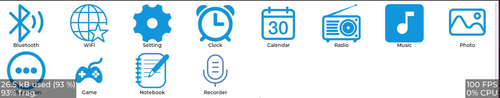
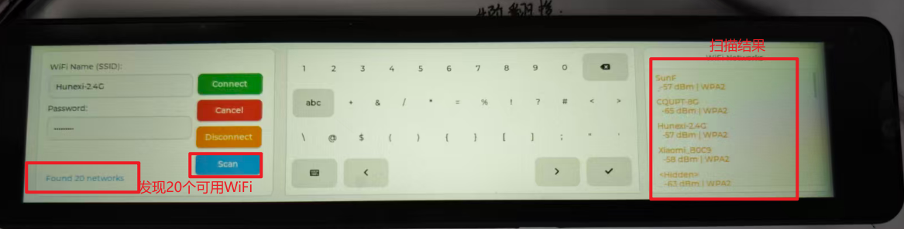
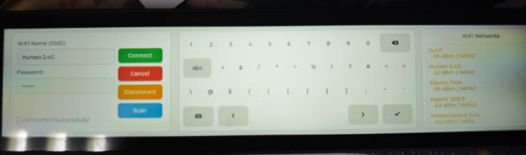
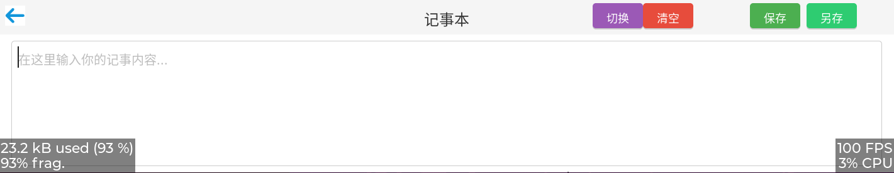
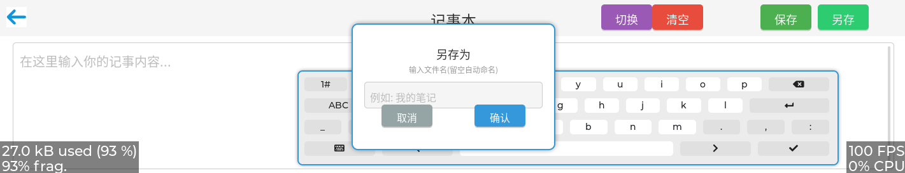

# 🚀 T113_LVGL 多功能演示

<div align="center">

[](https://www.linux.org/)
[](https://lvgl.io)
[](https://cmake.org/)
[](LICENSE)

</div>

---

## 📋 项目概述

面向全志 T113-S3 的 LVGL 8.x 多功能演示应用，覆盖 UI、音频播放与录音、记事本、WiFi、HTTP、日志/存储等模块，便于快速验证与二次开发（参考分辨率 720x1424 横屏）。

---

## 🖥️ 主界面展示


---

## 🧩 技术栈
- UI：LVGL 8.x
- 硬件：Allwinner T113-S3 SoC
- 音频：ALSA（aplay / arecord / amixer），异步播放器
- 网络：HTTP 客户端，WPA Supplicant 控制
- 存储：原子写文件接口 + SQLite 数据库
- 并发：OSAL 线程 / 队列抽象
- 资源：字体 / 图片 / 音乐打包，启动 logo 可替换（FAT16 boot-resource）

---

## ✨ 核心功能（app7）

### 🏠 启动与导航
- **启动页**: `pageStart.c` —— 显示开机 logo 和动画，完成系统初始化后的 UI 入口
- **主菜单**: `pageMenu.c` —— 统一导航中心，管理功能入口并转发 UI 事件

<div align="center">

</div>

### ⏰ 时钟展示
- **数字时钟**: `page_clock.c` —— 实时显示日期与时间，定时刷新与排版示例


### 📡 WiFi 配网
- **网络管理**: `pageWifi.c` —— 基于 wpa_supplicant
  - 扫描周边 WiFi 热点
  - 选择目标网络并输入密码
  - 连接状态实时提示
  - 支持断线重连

<div align="center">


</div>

### 🎵 音乐播放
- **播放器**: `pageMusic.c` + `music/audio_player_async.c`
  - 播放列表管理
  - 播放 / 暂停 / 停止控制
  - 进度条拖动与显示
  - 音量调节
  - 异步解码与播放线程，不阻塞 UI


### 🎤 录音回放
- **录音功能**: `pageMicrophone.c`
  - 使用 arecord 录制音频
  - 使用 aplay 即时回放
  - 录音状态实时提示
  - 失败反馈与错误处理


### 📝 记事本
- **笔记管理**: `pagenotebook.c`
  - 历史记录列表展示
  - 新增 / 重命名 / 删除笔记
  - 原子写入机制防止掉电损坏
  - 保存成功 toast 提示
  - 自定义文件名输入与校验

<div align="center">


</div>

### ⚙️ 设置入口
- **系统设置**: `page_setting.c` —— 预留扩展接口，可添加：
  - 屏幕亮度调节
  - 音量全局控制
  - 网络参数配置
  - 其他系统级参数


### 📨 消息与解耦
- **消息总线**: `ui_msg.c/h` —— 页面间消息分发与通信范式，实现模块解耦

---

## 📁 目录结构速览
```
app7/                 # 主工程代码（页面与业务逻辑）
   page_*.c            # 功能页面
   file/               # 原子写、日志、SQLite 封装
   music/              # 异步播放器
   net/                # HTTP 管理
   wifi/               # WPA 控制
   osal/               # 线程 / 队列抽象
   res/                # 字体、图片、音乐（含 image/main/bootlogo.bmp）
platform/t113/lib/    # T113 运行时依赖库
build/                # 编译输出（build/app/demo 或 build/app7/demo7）
```

---

## 🛠️ 环境要求
```
cmake >= 3.15
如果本地 cmake 低于 3.15，可按如下升级：
wget http://www.cmake.org/files/v3.15/cmake-3.15.3.tar.gz
tar -xvzf cmake-3.15.3.tar.gz
cd cmake-3.15.3 && ./configure && make && sudo make install
cmake --version

Linux 仿真依赖：
sudo apt-get install build-essential libsdl2-dev -y
```

---

## 🔧 编译说明
```
1) 交叉编译工具链路径
   修改 build.sh 中 toolchain_path 为本机路径：
   toolchain_path="/home/xiaozhi/t113-v1.1/prebuilt/rootfsbuilt/arm/toolchain-sunxi-glibc-gcc-830/toolchain/bin"

2) 编译指令
   编译 T113 版本：   ./build.sh -t113
   编译 Linux 仿真： ./build.sh -linux
   清理：            ./build.sh -clean
   提示：修改 CMakeLists 或分辨率参数后，先 clean 再编译；切换目标（板卡/PC）亦需 clean。

3) 产物位置
   build/app/demo      （或 build/app7/demo7，视具体配置）

4) 推送到设备
   adb push platform/t113/lib/* /usr/lib/   # 首次或库变动
   adb push build/app/res/* /usr/res/       # 首次或资源变动
   adb push build/app/demo /usr/bin/        # 应用本体（如 demo7）

5) 自启动设置
   vi /etc/init.d/rc.final
   将启动行改为：/usr/bin/demo &
   保存后 reboot 确认生效
```

---

## 🧠 模块说明（简要）
- 原子写 / 日志：`file/file_atomic.c`，`file/SQL/*`（SQLite 日志、事件、系统/文本日志）
- 音频：`music/audio_player_async.c`（异步播放）；录音 / 回放逻辑在 `pageMicrophone.c`
- 网络 / HTTP：`net/http_manager.c`
- WiFi：`wifi/wpa_manager.c`（控制 wpa_supplicant）
- OSAL：`osal_thread.c`, `osal_queue.c` 抽象线程与消息队列
- UI 消息：`ui_msg.c/h` 页面间消息分发

---

## 🖼️ 启动 logo 替换（boot-resource）
1) 分区：`/dev/mtdblock5`（FAT16）挂载到 `/mnt/boot-resource`
2) 替换：
   ```bash
   mount -t vfat /dev/mtdblock5 /mnt/boot-resource
   cp /tmp/bootlogo.bmp /mnt/boot-resource/bootlogo.bmp
   sync && umount /mnt/boot-resource
   ```
3) 建议：图片尺寸与屏幕方向匹配，必要时先在 PC 上调整分辨率再推送

---

## 🔍 常用 adb 命令
```
adb push demo7 /usr/bin/demo      # 推送应用
adb shell chmod +x /usr/bin/demo  # 确保可执行
adb shell reboot                  # 重启测试
```

---

## 📧 联系方式

如有任何技术问题或建议，欢迎通过 GitHub Issues 联系。

---

<div align="center">
<b>⭐ 如果这个项目对你有帮助，请给它一个星标！</b>
</div>
